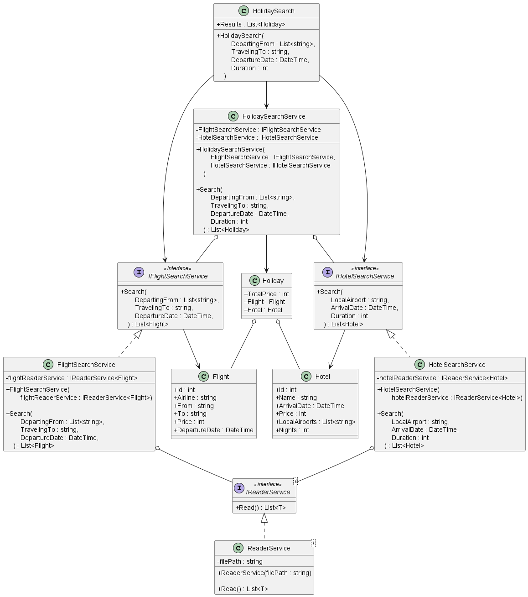

# HolidaySearch

This is a C# solution to the Holiday Search programming exercise.

The task is to take the two JSON files in `HolidaySearchLibrary/JsonFiles` folder:

```
📂HolidaySearchLibrary
┗ 📂JsonFiles
  ┣ 📜FlightData.json
  ┗ 📜HotelData.json
```

as source data, and create a small library of code that provides a basic holiday search feature.

# Instructions - Run the Tests

**Prerequisite**: The machine running the application should have [.NET 6.0](https://dotnet.microsoft.com/en-us/download/dotnet/6.0) (or above) installed.

To run the tests:

1. clone the repository to your computer
2. then navigate to the `HolidaySearchLibrary.Tests` folder (with `cd` command or otherwise)
3. then run the following command

```c#
dotnet test
```

Then you should see all the test cases have passed.

# Instructions - Use the library

**Prerequisite**: The machine running the application should have [.NET 6.0](https://dotnet.microsoft.com/en-us/download/dotnet/6.0) (or above) installed.

Clone the repository to your computer.

Then add project reference to the `HolidaySearchLibrary` project or otherwise so that your own project can access the `HolidaySearchLibrary` classes.

To search for holidays such that:

- Departing from: Manchester Airport (MAN)
- Traveling to: Malaga Airport (AGP)
- Departure Date: 2023/07/01
- Duration: 7 nights

use the following C# code:

```c#
var holidaySearch = new HolidaySearch(
  departingFrom: new() { "MAN" },
  travelingTo: "AGP",
  departureDate: DateTime.Parse("2023/07/01"),
  duration: 7
);

List<Holiday> holidays = holidaySearch.Results;
```

where the first result in `holidaySearch.Results` is the best value holiday.

But if you want the `holidaySearch` result to contain holidays departing from a list of **multiple** different airports, then specify those airports in the `departingFrom` list, so the C# code would be:

```c#
var holidaySearch = new HolidaySearch(
  departingFrom: new() { "MAN", "LCY", "LHR" }, // multiple airports
  travelingTo: "AGP",
  departureDate: DateTime.Parse("2023/07/01"),
  duration: 7
);

List<Holiday> holidays = holidaySearch.Results;
```

But if you want the `holidaySearch` result to contain holidays departing from **any** airport, then set the `departingFrom` to an empty list, so the C# code would be:

```c#
var holidaySearch = new HolidaySearch(
  departingFrom: new(), // all airports
  travelingTo: "AGP",
  departureDate: DateTime.Parse("2023/07/01"),
  duration: 7
);

List<Holiday> holidays = holidaySearch.Results;
```

# UML Class Diagram

This is the UML Class Diagram of this solution.



| Classes                | Purposes                                                                                                                                                                       |
| ---------------------- | ------------------------------------------------------------------------------------------------------------------------------------------------------------------------------ |
| `ReaderService`        | Reads JSON file into list of `Flight`s or `Hotel`s                                                                                                                             |
| `FlightSearchService`  | Searches for a list of `Flight`s that satisfy search conditions, with dependency injection of `IReaderService`                                                                 |
| `HotelSearchService`   | Searches for a list of `Hotel`s that satisfy search conditions, with dependency injection of `IReaderService`                                                                  |
| `HolidaySearchService` | Searches for a list of `Holiday`s that satisfy search conditions, with dependency injections of `IFlightSearchService` and `IHotelSearchService`                               |
| `HolidaySearch`        | A wrapper that uses `HolidaySearchService` to search for a list of `Holiday`s that satisfy search conditions, so that it can inject the all the dependency injections required |
